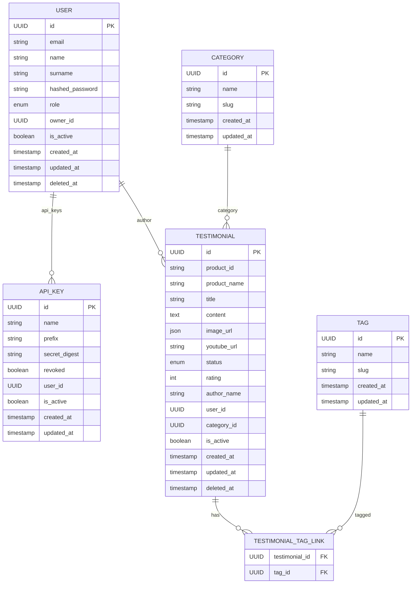

# Documentación de la Base de Datos — Testify

Este documento describe el modelo relacional actual utilizado por Testify, basado en los modelos definidos en `app/models/`.
Incluye tablas principales, columnas, claves, restricciones, enumeraciones y recomendaciones de índices.

---

## Visión general

Testify gestiona testimonios, categorías, etiquetas, usuarios y claves de API. Las decisiones principales tomadas en el diseño actual son:

- Identificadores: `UUID` para la mayoría de entidades (generados por `Abstract`).
- Soft delete: modelos que heredan de `AbstractActive` (por ejemplo `User`, `Testimonial`, `APIKey`) incluyen `is_active` y `deleted_at`.
- `image_url` en `Testimonial` se almacena como JSON (lista de strings).
- Relación many-to-many entre `Testimonial` y `Tag` mediante `TestimonialTagLink` (tabla de enlace).
- `APIKey` se almacena con `prefix` y `secret_digest` (digest del token), asociado a `User`.

---

## Diagramas (Mermaid)



---

## Modelos y tablas principales

Las siguientes descripciones se corresponden con las clases definidas en `app/models`.

### 1) `User` (tabla `user`)

- Hereda de `AbstractActive` (campos: `id: UUID`, `created_at`, `updated_at`, `is_active`, `deleted_at`).
- Campos principales:

  - `email: EmailStr` — índice y único (no nulo)
  - `name: str | None`
  - `surname: str | None`
  - `hashed_password: str` — requerido
  - `role: enum Roles` — valores: `owner`, `admin`, `moderator`
  - `owner_id: UUID | None` — clave foránea auto-referencial (`foreign_key='user.id'`) usada para multitenancy (si un usuario pertenece a un tenant se guarda el `owner_id` del propietario)

- Relaciones:

  - `testimonials` (1:N)
  - `api_keys` (1:N)

- Índices recomendados:
  - `UNIQUE(email)`
  - `index(is_active)` si se filtra por usuarios activos

### 2) `APIKey` (tabla `api_key`)

- Hereda de `AbstractActive`.
- Campos principales:

  - `name: str | None` — nombre humano opcional
  - `prefix: str` — prefix del token, índice para lookup rápido
  - `secret_digest: str` — digest HMAC/SHA del token
  - `revoked: bool`
  - `user_id: UUID | None` — FK a `user.id` (ondelete=SET NULL)

- Uso: almacenar claves de API por tenant/usuario, comparar `prefix` y verificar digest.

### 3) `Category` (tabla `category`)

- Hereda de `Abstract` (no soft-delete).
- Campos principales:

  - `name: str` — indexado
  - `slug: str` — indexado y único

- Relaciones:
  - `testimonials` (1:N)

### 4) `Tag` (tabla `tag`)

- Hereda de `Abstract`.
- Campos principales:

  - `name: str` — indexado y único
  - `slug: str` — indexado y único

- Relaciones:
  - many-to-many con `Testimonial` a través de `TestimonialTagLink`

### 5) `Testimonial` (tabla `testimonial`)

- Hereda de `AbstractActive`.
- Campos principales:

  - `product_id: str` — identificador del producto (no necesariamente UUID)
  - `product_name: str`
  - `title: str | None`
  - `content: str | None`
  - `youtube_url: str | None`
  - `image_url: list[str]` — almacenado como columna JSON en la BD (valor por defecto `[]`)
  - `status: enum StatusType` — `pending`, `approved`, `rejected` (por defecto `pending`)
  - `rating: int | None`
  - `author_name: str | None`
  - `user_id: UUID | None` — FK a `user.id` (ondelete=SET NULL)
  - `category_id: UUID | None` — FK a `category.id` (ondelete=SET NULL)

- Relaciones:

  - `author` (User)
  - `category` (Category)
  - `tags` (many-to-many via `TestimonialTagLink`)

- Índices recomendados:
  - `index(status)`, `index(user_id)`, `index(category_id)`, `index(created_at)`

### 6) `TestimonialTagLink` (tabla `testimonial_tag_link`)

- Tabla de enlace many-to-many definida por `TestimonialTagLink`:
  - `testimonial_id: UUID` — FK a `testimonial.id`
  - `tag_id: UUID` — FK a `tag.id`
  - PK compuesta: (`testimonial_id`, `tag_id`)

---

## Esquema SQL de ejemplo (Postgres) — ajustado a los modelos actuales

```sql
-- Abstract/Utility: se asume que `id UUID` y timestamps se crean por Default en las clases base

-- Users
CREATE TABLE "user" (
  id UUID PRIMARY KEY,
  email VARCHAR(255) NOT NULL UNIQUE,
  name VARCHAR(255),
  surname VARCHAR(255),
  hashed_password VARCHAR(255) NOT NULL,
  role VARCHAR(20) NOT NULL,
  owner_id UUID REFERENCES "user"(id) ON DELETE SET NULL,
  is_active BOOLEAN DEFAULT TRUE,
  created_at TIMESTAMP WITH TIME ZONE DEFAULT now(),
  updated_at TIMESTAMP WITH TIME ZONE DEFAULT now(),
  deleted_at TIMESTAMP WITH TIME ZONE
);

-- API Keys
CREATE TABLE api_key (
  id UUID PRIMARY KEY,
  name VARCHAR(50),
  prefix VARCHAR(16) NOT NULL,
  secret_digest VARCHAR(128) NOT NULL,
  revoked BOOLEAN DEFAULT FALSE,
  user_id UUID REFERENCES "user"(id) ON DELETE SET NULL,
  is_active BOOLEAN DEFAULT TRUE,
  created_at TIMESTAMP WITH TIME ZONE DEFAULT now(),
  updated_at TIMESTAMP WITH TIME ZONE DEFAULT now(),
  deleted_at TIMESTAMP WITH TIME ZONE
);

-- Categories
CREATE TABLE category (
  id UUID PRIMARY KEY,
  name VARCHAR(255) NOT NULL,
  slug VARCHAR(255) NOT NULL UNIQUE,
  created_at TIMESTAMP WITH TIME ZONE DEFAULT now(),
  updated_at TIMESTAMP WITH TIME ZONE DEFAULT now()
);

-- Tags
CREATE TABLE tag (
  id UUID PRIMARY KEY,
  name VARCHAR(255) NOT NULL UNIQUE,
  slug VARCHAR(255) NOT NULL UNIQUE,
  created_at TIMESTAMP WITH TIME ZONE DEFAULT now(),
  updated_at TIMESTAMP WITH TIME ZONE DEFAULT now()
);

-- Testimonials
CREATE TABLE testimonial (
  id UUID PRIMARY KEY,
  product_id TEXT NOT NULL,
  product_name TEXT NOT NULL,
  title VARCHAR(200),
  content TEXT,
  youtube_url VARCHAR(500),
  image_url JSONB DEFAULT '[]'::jsonb,
  status VARCHAR(20) NOT NULL,
  rating INTEGER,
  author_name VARCHAR(255),
  user_id UUID REFERENCES "user"(id) ON DELETE SET NULL,
  category_id UUID REFERENCES category(id) ON DELETE SET NULL,
  is_active BOOLEAN DEFAULT TRUE,
  created_at TIMESTAMP WITH TIME ZONE DEFAULT now(),
  updated_at TIMESTAMP WITH TIME ZONE DEFAULT now(),
  deleted_at TIMESTAMP WITH TIME ZONE
);

-- Association table
CREATE TABLE testimonial_tag_link (
  testimonial_id UUID NOT NULL REFERENCES testimonial(id) ON DELETE CASCADE,
  tag_id UUID NOT NULL REFERENCES tag(id) ON DELETE CASCADE,
  PRIMARY KEY (testimonial_id, tag_id)
);
```

---

## Comentarios y recomendaciones

- `Tag.id` usa `UUID` (coherente con `Abstract`). Si ha habido datos previos con `SERIAL`, planificar migración.
- `Testimonial.image_url` se guarda como `JSONB` y contiene una lista de URLs (strings). Esto facilita múltiples imágenes por testimonial.
- `User.owner_id` es una FK auto-referencial útil para multitenancy — asegura que administradores se asocien al `owner` del tenant.
- `APIKey` guarda solo `secret_digest` y `prefix` para permitir revocación y búsqueda segura.
- Considerar índices GIN en `image_url` si se hacen búsquedas dentro del JSON (no usual).
- Añadir triggers o políticas para actualizar `updated_at` automáticamente (ya existe comportamiento en modelos via SQLModel sa_column_kwargs).

---
