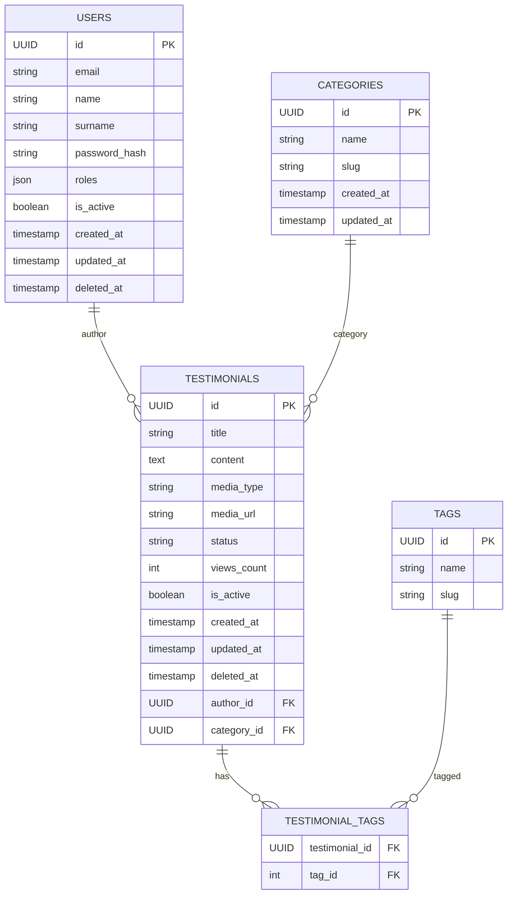

# Documentación de la Base de Datos — Testify

Este documento describe el modelo relacional usado por Testify: tablas principales, columnas, claves primarias y foráneas, índices recomendados y un diagrama entidad-relación (ER) en ASCII.

---

## Visión general

Testify gestiona testimonios, categorías, tags y usuarios. Las decisiones principales tomadas en el diseño:

- Identificadores: `UUID` para todas las entidades
- Soft delete para `users` y `testimonials` usando `is_active` y `deleted_at`.
- Many-to-many entre `testimonials` y `tags` mediante tabla de asociación `testimonial_tags`.
- Timestamps `created_at`, `updated_at` en entidades que lo necesiten.

---

## Diagramas (Mermaid)



## Tablas principales

A continuación se definen las tablas con columnas, tipos y restricciones principales.

### 1) users

- Nombre de tabla: `users`
- Columnas principales:

  - `id` UUID PRIMARY KEY
  - `email` VARCHAR UNIQUE NOT NULL
  - `name` VARCHAR
  - `surname` VARCHAR
  - `is_active` BOOLEAN DEFAULT TRUE
  - `roles` JSONB or TEXT (lista de roles, p.ej. ['admin','moderator','user'])
  - `hashed_password` VARCHAR NOT NULL
  - `created_at` TIMESTAMP WITH TIME ZONE DEFAULT now()
  - `updated_at` TIMESTAMP WITH TIME ZONE DEFAULT now()

- Índices recomendados:

  - UNIQUE(email)
  - index on `is_active` if queries filter by active users

- Comentarios:
  - `roles` puede almacenarse como arreglo JSONB o table normalizada si se requiere consultas complejas.

---

### 2) categories

- Nombre de tabla: `categories`
- Columnas principales:

  - `id` UUID PRIMARY KEY
  - `name` VARCHAR NOT NULL
  - `slug` VARCHAR UNIQUE NOT NULL
  - `created_at`, `updated_at` TIMESTAMP

- Índices recomendados:
  - UNIQUE(slug)
  - index(name)

---

### 3) tags

- Nombre de tabla: `tags`
- Columnas principales:

  - `id` UUID PRIMARY KEY
  - `name` VARCHAR NOT NULL
  - `slug` VARCHAR UNIQUE NOT NULL

- Índices:

  - UNIQUE(slug)
  - index(name)

- Comentario:
  - Los ejemplos actuales usan `int` para `tags.id`. Si se desea uniformidad, se puede migrar a `UUID` posteriormente (requerirá migración de datos y cambios en la tabla de asociación).

---

### 4) testimonials

- Nombre de tabla: `testimonials`
- Columnas principales:

  - `id` UUID PRIMARY KEY
  - `title` VARCHAR(200) NOT NULL
  - `content` TEXT NOT NULL
  - `media_type` VARCHAR(10) NOT NULL CHECK (media_type IN ('text','image','video'))
  - `media_url` VARCHAR(500) NULL
  - `status` VARCHAR(10) NOT NULL CHECK (status IN ('pending','approved','rejected'))
  - `views_count` INTEGER NOT NULL DEFAULT 0
  - `author_id` UUID NOT NULL -- FK -> users(id)
  - `category_id` UUID NULL -- FK -> categories(id)
  - `created_at` TIMESTAMP WITH TIME ZONE DEFAULT now()
  - `updated_at` TIMESTAMP WITH TIME ZONE DEFAULT now()
  - `deleted_at` TIMESTAMP WITH TIME ZONE NULL -- soft delete

- Índices recomendados:
  - index(status)
  - index(author_id)
  - index(category_id)
  - index(created_at)
  - Full-text index over `title` + `content` (optional) for search

---

### 5) testimonial_tags (tabla de asociación many-to-many)

- Nombre de tabla: `testimonial_tags`
- Columnas:
  - `testimonial_id` UUID NOT NULL -- FK -> testimonials(id)
  - `tag_id` INTEGER NOT NULL -- FK -> tags(id)
- PK compuesta: (`testimonial_id`, `tag_id`)
- Índices:
  - PK compuesta actúa como índice para búsquedas por testimonial
  - index(tag_id) para consultas por tag

---

## Esquema SQL de ejemplo (Postgres)

```sql
-- Users
CREATE TABLE users (
  id UUID PRIMARY KEY,
  email VARCHAR(255) NOT NULL UNIQUE,
  name VARCHAR(255),
  surname VARCHAR(255),
  is_active BOOLEAN DEFAULT TRUE,
  roles JSONB,
  hashed_password VARCHAR(255) NOT NULL,
  created_at TIMESTAMP WITH TIME ZONE DEFAULT now(),
  updated_at TIMESTAMP WITH TIME ZONE DEFAULT now()
);

-- Categories
CREATE TABLE categories (
  id UUID PRIMARY KEY,
  name VARCHAR(255) NOT NULL,
  slug VARCHAR(255) NOT NULL UNIQUE,
  created_at TIMESTAMP WITH TIME ZONE DEFAULT now(),
  updated_at TIMESTAMP WITH TIME ZONE DEFAULT now()
);

-- Tags
CREATE TABLE tags (
  id SERIAL PRIMARY KEY,
  name VARCHAR(100) NOT NULL,
  slug VARCHAR(100) NOT NULL UNIQUE
);

-- Testimonials
CREATE TABLE testimonials (
  id UUID PRIMARY KEY,
  title VARCHAR(200) NOT NULL,
  content TEXT NOT NULL,
  media_type VARCHAR(10) NOT NULL,
  media_url VARCHAR(500),
  status VARCHAR(10) NOT NULL,
  views_count INTEGER NOT NULL DEFAULT 0,
  author_id UUID NOT NULL REFERENCES users(id),
  category_id UUID REFERENCES categories(id),
  created_at TIMESTAMP WITH TIME ZONE DEFAULT now(),
  updated_at TIMESTAMP WITH TIME ZONE DEFAULT now(),
  deleted_at TIMESTAMP WITH TIME ZONE
);

-- Association table
CREATE TABLE testimonial_tags (
  testimonial_id UUID NOT NULL REFERENCES testimonials(id),
  tag_id INTEGER NOT NULL REFERENCES tags(id),
  PRIMARY KEY (testimonial_id, tag_id)
);
```

---
